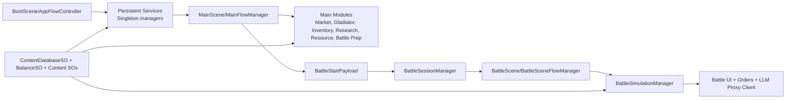
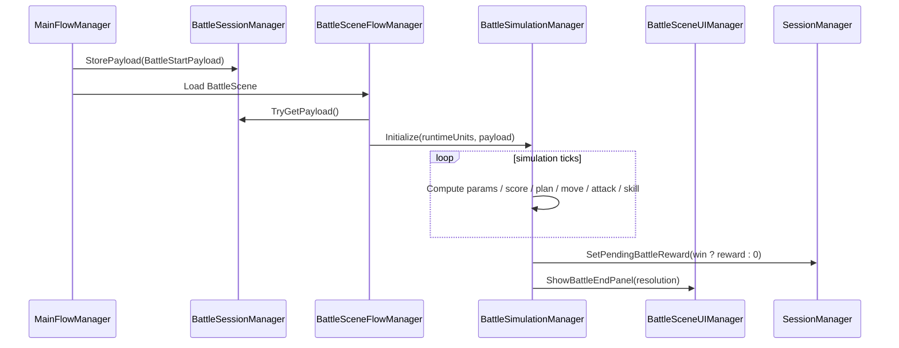
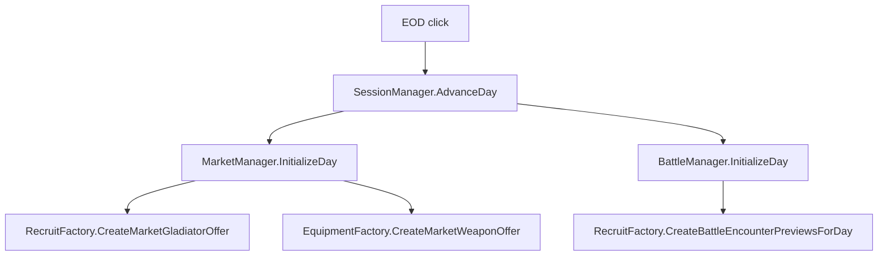

# Project Architecture Blueprint

Generated on: 2026-04-23 (Asia/Seoul)
Repository: `main-game`
Unity Version: `6000.0.71f1`

## 1. Architecture Detection and Analysis

### Detected technology stack
- Engine/runtime: Unity 6 (URP, UGUI, TextMeshPro)
- Language: C# (`Assembly-CSharp`)
- Data model style: ScriptableObject-driven content and balancing
- Networking/API client: UnityWebRequest-based HTTP client for battle LLM order proxy
- Input/UI: Unity Input System + UGUI

### Detected architecture pattern
Primary pattern is a **scene-oriented layered monolith** with persistent singleton services:
- Boot layer: creates long-lived managers and session context
- Main scene application layer: orchestrates daily economy/recruit/market/research/battle preparation
- Battle scene runtime layer: simulates combat from immutable-ish payload snapshots
- Content layer: ScriptableObject databases and static balance knobs

Secondary patterns:
- Strategy pattern for battle action planners (`IBattleActionPlanner`)
- Registry pattern for battle skills (`BattleSkillRegistry`)
- DTO/adapter pattern for LLM prompt/response transport
- Facade-like orchestration via `MainFlowManager` and `BattleSceneFlowManager`

## 2. Architectural Overview

This codebase is a single Unity client containing two major runtime contexts:
- `MainScene`: economy/progression loop (day cycle, market, roster, battle preparation)
- `BattleScene`: deterministic-ish simulation loop initialized from a cross-scene payload

Guiding principles evident in implementation:
- Runtime state is centralized in singleton managers (`SessionManager`, `ResourceManager`, `GladiatorManager`, `InventoryManager`, etc.)
- Authoring data is externalized to ScriptableObjects and injected through `ContentDatabaseProvider`
- Scene transitions use explicit payload handoff (`BattleSessionManager`) rather than implicit global mutable objects
- Battle AI is decomposed into scoring, planner selection, and execution phases

## 3. Architecture Visualization

### High-level subsystem map



### Battle runtime interaction view



### Main scene day-cycle and encounter generation



## 4. Core Architectural Components

### Boot and persistent services (`Assets/Scripts/BootScripts`)
- `AppFlowController`: boot orchestration and scene bootstrap.
- `SceneLoader`: centralized async scene loading with lock (`IsLoading`).
- `SessionManager`: session/day lifecycle, battle-usage flags, pending reward escrow, class-name counters.
- `RandomManager`: seeded, stream-separated RNGs (Recruit/Equipment/BattleEncounter/BattleSimulation).
- `ContentDatabaseProvider`: typed gateway over `ContentDatabaseSO`.
- `BattleSessionManager`: cross-scene payload shuttle for battle start.

### Main scene domain/application (`Assets/Scripts/MainScripts`)
- `MainFlowManager`: top-level composition root for scene managers, factories, and UI ownership state.
- Economy and ownership:
  - `ResourceManager`, `GladiatorManager`, `InventoryManager`, `MarketManager`
- Generation:
  - `RecruitFactory`, `EquipmentFactory`
- Battle prep context:
  - `BattleManager`, `BattleUIManager`, `BattleContracts`
- Research context:
  - `ResearchManager`, `ResearchUIManager`

### Battle scene runtime (`Assets/Scripts/BattleScene`)
- `BattleSceneFlowManager`: payload ingestion and runtime unit spawn/bootstrap.
- `BattleRuntimeUnit` + `BattleUnitCombatState`: per-unit runtime state machine and stats/cooldowns/status.
- `BattleSimulationManager`: tick loop, decision system, planner execution, combat resolution.
- Tactical abstractions:
  - `IBattleActionPlanner` + planner implementations (`BattlePlanners/*`)
  - `IBattleSkill` + skill implementations (`BattleSkills/*`) + `BattleSkillRegistry`
- Diagnostics/UI:
  - `BattleStatusGridUIManager`, `BattleSceneUIManager`

### LLM command subsystem (`Assets/Scripts/BattleScene/LLMrelated`)
- `BattleOrdersManager`: validates, builds prompt payload, routes to HTTP client, validates parsed response.
- `BattleOrdersHttpClient`: UnityWebRequest POST with app token header.
- Prompt/response DTOs: explicit shape for strict command contracts.

## 5. Architectural Layers and Dependencies

Implemented layer model:
1. Presentation layer
- Scene UIs and MonoBehaviours (`*UIManager`, `MainFlowManager`, `BattleSceneFlowManager`)
2. Application/service layer
- Managers and factories orchestrating use cases (`MarketManager`, `BattleManager`, etc.)
3. Domain/runtime model layer
- Owned data classes, battle contracts, combat state, planners, skill interfaces
4. Content/config layer
- ScriptableObject assets (`BalanceSO`, `WeaponSO`, etc.)
5. Infrastructure layer
- Scene loading, RNG service, HTTP client, persistence across scenes via singleton game objects

Dependency direction is mostly top-down:
- UI -> Managers -> Factories/Domain models -> ScriptableObject content
- Battle simulation -> planners/skills via interfaces
- LLM subsystem -> DTO + HTTP infrastructure

Observed coupling hotspots:
- Heavy singleton usage creates implicit global dependencies and runtime ordering assumptions.
- `MainFlowManager` acts as a large orchestration hub.
- Stat recalculation logic is duplicated in both `GladiatorManager` and `RecruitFactory`.

## 6. Data Architecture

### Domain entities/value objects
- Persistent-ish runtime entities:
  - `OwnedGladiatorData`
  - `OwnedWeaponData`
- Battle immutable transfer snapshots:
  - `BattleUnitSnapshot`
  - `BattleEncounterPreview`
  - `BattleStartPayload`

### Content model (ScriptableObject)
- Global composition:
  - `ContentDatabaseSO` -> lists of `GladiatorClassSO`, `WeaponSO`, `WeaponSkillSO`, `TraitSO`, `PersonalitySO`, `PerkSO`, `SynergySO`, plus `BalanceSO`
- Behavioral tuning:
  - `BalanceSO` economic/progression/randomization knobs
  - `BattleAITuningSO` for action weights/radii

### Data flow patterns
- Authoring-time asset data -> runtime previews -> owned runtime copies:
  - Market uses preview objects with `RuntimeId=0`
  - Purchase copies preview into owned instance with new runtime id
- Main->Battle scene transfer:
  - owned/preview data -> `BattleUnitSnapshot` clones -> `BattleStartPayload` -> `BattleSessionManager`

### Validation patterns
- Runtime guards throughout managers (`if (!_initialized)`, null checks, bounds checks)
- Response validation for LLM output before any application attempt

## 7. Cross-Cutting Concerns Implementation

### Authentication & authorization
- No user identity/auth subsystem in client runtime.
- LLM proxy calls use shared header token (`X-App-Token`) in `BattleOrdersHttpClient`.
- Secret handling currently serialized in scene component fields (`BattleOrdersManager.appSharedToken`) and should be considered non-production-safe.

### Error handling & resilience
- Predominantly defensive checks with `Debug.LogError/Warning` and early returns.
- Transaction-like rollback exists for purchases (refund gold on add-failure in `MarketManager`).
- LLM path has parse + schema-like semantic validation and explicit no-op fallback.

### Logging & observability
- `verboseLog` flags are pervasive and provide trace logging by subsystem.
- No structured external telemetry sink detected.

### Configuration management
- Scene-injected serialized fields for wiring and behavior toggles.
- Global balance/config via ScriptableObject assets.
- Build/dependency config via Unity `ProjectSettings/` and `Packages/manifest.json`.

### Validation
- Input guards in UI and manager methods.
- LLM action validation includes unit-id whitelist checks and action-count limits.

## 8. Service Communication Patterns

### Intra-scene communication
- Direct method invocation through references and singleton `Instance` lookups.
- Unity events (`Button.onClick`) drive use-case entry points.

### Cross-scene communication
- `SceneLoader` for navigation.
- `BattleSessionManager` for payload handoff.

### External communication
- HTTP POST to proxy endpoint (UnityWebRequest).
- JSON serialization via `JsonUtility` for outbound and DTO parsing inbound.

Synchronous vs async:
- Scene loading and HTTP communication are asynchronous coroutines.
- Simulation is synchronous fixed tick in `Update` loop.

## 9. Unity-Specific Architectural Patterns

- `DontDestroyOnLoad` singleton services on boot object graph.
- Scene as bounded context (Main vs Battle).
- ScriptableObject-first content pipeline.
- Inspector-driven dependency injection for scene-local references.
- Deterministic stream RNG partitioning for replay/stability characteristics.

## 10. Implementation Patterns

### Interface patterns
- Planner strategy interface:
  - `IBattleActionPlanner.Build(...)`
  - `IBattleActionPlanner.IsUsable(...)`
- Skill abstraction split from effect application via `ISkillEffectApplier`.
- Animation abstraction via `IAnimationProvider` decouples runtime unit from concrete animation source.

### Service/factory patterns
- Factories create preview instances (`RecruitFactory`, `EquipmentFactory`).
- Managers own authoritative mutable collections and purchase/sell transactions.

### Repository/data access
- No DB/repository layer; content access is in-memory via ScriptableObject provider.

### API/controller analogs
- No HTTP server/controller in client.
- `BattleOrdersManager` acts as local command controller for LLM requests.

## 11. Testing Architecture

Current state:
- No formal unit/integration test assemblies detected.
- Test-oriented runtime helper exists:
  - `BattleSceneTester` and `BattleTestPresetSO` for in-scene scenario bootstrapping.

Implication:
- Testing currently relies on play-mode/manual simulation harnessing.
- High-value next step is extracting pure C# decision/score functions into testable assemblies.

## 12. Deployment Architecture

Detected deployment/runtime model:
- Unity client build (desktop/mobile target not pinned in code).
- No container/orchestration manifests.
- CI workflow present in `.github/workflows/auto-approve-inactivity.yml` is governance automation, not build/test/deploy pipeline.

Environment-specific behavior:
- Editor-only forced seed option in `AppFlowController` for deterministic debugging.
- Scene names and serialized fields are environment/config dependent.

## 13. Extension and Evolution Patterns

### Feature addition patterns
- New main feature panel:
  1. Add manager + UI manager in `MainScripts/MainMenu/*`
  2. Inject references into `MainFlowManager`
  3. Add `Handle*Requested` transition methods and UI ownership rules
- New battle action behavior:
  1. Implement `IBattleActionPlanner`
  2. Register in `BuildPlannerRegistry()`
  3. Add tuning entry in `BattleAITuningSO`
- New weapon skill:
  1. Implement `IBattleSkill`
  2. Register in `BattleSkillRegistry`
  3. Create `WeaponSkillSO` content mapping to `WeaponSkillId`

### Modification patterns
- Preserve snapshot boundary when changing cross-scene data.
- Keep preview-vs-owned distinction (`RuntimeId=0` previews, unique IDs for owned).
- Prefer extending `BalanceSO` for knobs instead of hardcoding values.

### Integration patterns
- External systems should follow DTO + validation + no-op fallback style used in LLM subsystem.
- Keep infrastructure calls (HTTP/scene) isolated in dedicated service/helper classes.

## 14. Architectural Pattern Examples

### Layered orchestration pattern
```csharp
// MainFlowManager.InitializeScene (simplified)
resourceManager.Initialize(balance);
marketManager.Initialize(recruitFactory, equipmentFactory, gladiatorManager, inventoryManager, resourceManager);
battleManager.Initialize(sessionManager, balance, recruitFactory);
```

### Cross-scene payload boundary
```csharp
// Main -> Battle handoff
battleSessionManager.StorePayload(payload);
sceneLoader.TryLoadScene("BattleScene");

// Battle bootstrap
battleSessionManager.TryGetPayload(out BattleStartPayload payload);
battleSimulationManager.Initialize(runtimeUnits, battlefieldCollider, ..., payload);
```

### Planner strategy dispatch
```csharp
// BattleSimulationManager (concept)
BattleActionExecutionPlan plan = planner.Build(unit, field);
if (!planner.IsUsable(unit, plan, field)) { /* fallback */ }
```

### LLM defensive contract pipeline
```csharp
// BattleOrdersManager (concept)
BuildSystemInstruction();
BuildUserPayloadJson();
PostCommand(...);
TryParseLlmResponse(...);
ValidateLlmResponse(...); // reject invalid actions
```

## 15. Architectural Decision Records (Inferred)

### ADR-1: Persistent singleton services across scenes
- Context: shared game state needed across Boot/Main/Battle.
- Decision: use `SingletonBehaviour<T>` + `DontDestroyOnLoad` managers.
- Positive: straightforward access and lifecycle continuity.
- Negative: implicit dependencies and initialization-order sensitivity.

### ADR-2: ScriptableObject content database
- Context: balancing/content iteration required without code churn.
- Decision: `ContentDatabaseSO` + typed SO entries + provider wrapper.
- Positive: designer-friendly, data-driven tuning.
- Negative: runtime validation needed; weak compile-time guarantees.

### ADR-3: Snapshot payload handoff for battles
- Context: avoid direct battle dependency on mutable main-scene manager state.
- Decision: serialize battle start context into `BattleStartPayload` stored in `BattleSessionManager`.
- Positive: bounded context transfer, restart support (`_initialPayloadSnapshot`).
- Negative: payload schema drift risk and clone overhead.

### ADR-4: Hybrid AI (deterministic scorer + optional LLM orders)
- Context: need baseline tactical AI plus command experiments.
- Decision: keep simulation deterministic loop and add optional LLM order subsystem.
- Positive: safe fallback behavior and offline core loop continuity.
- Negative: additional validation complexity and operational secret handling concerns.

## 16. Architecture Governance

### Existing governance mechanisms
- Coding conventions in `.editorconfig`.
- Defensive runtime guards and verbose logs by subsystem.
- Dependency seams through interfaces in battle core (`IBattleActionPlanner`, `IBattleSkill`, `IAnimationProvider`).
- Limited repo governance automation (auto-approve inactive PR workflow).

### Missing governance guardrails
- No architectural linting/static dependency rules.
- No automated tests enforcing layer boundaries.
- No CI build/test pipeline for Unity project validation.

## 17. Blueprint for New Development

### Development workflow by feature type

#### Main-scene gameplay feature
1. Add/extend manager in `Assets/Scripts/MainScripts/MainMenu/<Feature>`.
2. Expose UI actions in corresponding `*UIManager`.
3. Wire dependencies in `MainFlowManager.InitializeScene()`.
4. Add/extend SO data entries in `Assets/Content/*` and provider exposure if needed.
5. Add play-mode validation in a controlled scene flow.

#### Battle mechanic feature
1. Add planner/skill class implementing existing interface.
2. Register in simulation registry.
3. Add balancing knobs in `BattleAITuningSO`/`BalanceSO`.
4. Verify status-grid outputs and battle-end resolution behavior.

#### External integration feature
1. Add DTOs for request/response contract.
2. Add isolated infrastructure client.
3. Add parse + semantic validator.
4. Keep no-op fallback on invalid external output.

### Implementation templates

#### New planner template
```csharp
public sealed class NewPlanner : IBattleActionPlanner
{
    public BattleActionType ActionType => BattleActionType.EngageNearest;

    public BattleActionExecutionPlan Build(BattleRuntimeUnit unit, BattleFieldView field)
    {
        // compute desired target/position
        return default;
    }

    public bool IsUsable(BattleRuntimeUnit unit, BattleActionExecutionPlan plan, BattleFieldView field)
    {
        return true;
    }
}
```

#### New battle skill template
```csharp
public sealed class NewSkill : IBattleSkill
{
    public WeaponSkillId SkillId => WeaponSkillId.None;
    public skillType SkillCategory => skillType.attack;
    public IReadOnlyList<WeaponType> CompatibleWeaponTypes => new[] { WeaponType.oneHand };

    public bool CanActivate(BattleRuntimeUnit caster, BattleFieldView field) => true;

    public void Apply(BattleRuntimeUnit caster, BattleFieldView field, ISkillEffectApplier applier)
    {
        // apply damage/heal/buff via applier
    }
}
```

### Common pitfalls to avoid
- Skipping `_initialized` checks when adding manager entry points.
- Mutating owned collections from UI directly instead of through manager APIs.
- Breaking preview/owned separation in market purchase flows.
- Introducing scene-name mismatches (e.g., serialized name vs BuildSettings path).
- Storing production secrets directly in serialized scene fields.

## Recommended Update Cadence

Regenerate this blueprint when any of the following changes:
- New scene or major manager/factory/service added
- Battle loop phase order or planner/skill registry changed
- Data schema changes in `BattleContracts` or SO content model
- External integration contract changes (LLM DTO/proxy API)

A practical cadence is at least once per milestone or every 2 weeks during active feature development.
